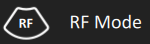

# Raw Data

This repository contains scripts and other code to read and process data collected from Clarius scanners. Each folder contains a specific project, and within includes sample data and matlab/python scripts to read, process, and display the data.

Data that can be acquired from Clarius scanners include:
* RF (raw radio frequency data)
* IQ (quadrature data)
* Envelope (B greyscale)

## Capture Modes
* To enable raw data capture, the **Buffer** icon from the modes menu can be pressed. The scanner will then buffer raw data while imaging.


* To enable RF data collection, the **RF** icon from the modes menu can be pressed. The scanner will then engage internal RF frame capture while scanning in B mode.


* IQ and envelope data is captured by default when RF mode is not engaged; RF and envelope data are captured by default when RF mode is engaged.

## RF Streaming
* RF streaming is enabled by default when engaging RF mode, and can be toggled through the **Stream** icon.


* RF mode collects data within the region-of-interest (ROI) placed over the greyscale image.
* While streaming is engaged, RF frames will be interleaved every 3 B/greyscale frames, and thus streamed at a lower frame rate than B. Buffering the RF data will also buffer at this rate.
* When streaming is disabled, RF frames will be interleaved with every B/greyscale frame, thus increasing the frame rate, and affected by the buffering control only.
* Streaming of RF data is used **only** for visualization within the App, therefore data streamed is not stored for further use; however when users connect to the scanner with the Cast API while RF is streaming, streaming of RF signals will automatically be routed to the API connected device.

## Downloading Raw Data
* Once imaging is frozen with raw data capture engaged, the capture image or capture cine buttons will automatically download the data from the scanner. Note that in all cases, a packaged .tar file is acquired which then uses an LZO compression scheme for further compressing the raw data. When data is accessed, users should ensure that the proper software to decompress the files is installed on their operating system.
* Downloading raw data over the wireless link can take some time since the packages can be large; for a single frame capture, a download time of 1-3 seconds is typical, for cine captures, where hundreds of frames may be acquired, downloads may take up to one minute.
* During the download, users must wait before imaging once again, progress is shown on the interface while this occurs.
* The scanner is pre-configured with raw data buffers of specific sizes that the system can support to offer stable and consistent imaging, in most cases, up to 10 seconds of raw IQ and RF can be captured, and upwards of 20 seconds of raw B/envelope data. The App can store a cine of up to 30 seconds, it is important to note that the raw data downloaded will always correspond to the latest frames in time. For example, if the cine capture markers are placed at 0-10 seconds within a 20 second capture, it is possible that no raw data will actually be downloaded.

### Accessing Raw Data

Once an exam has been completed and submitted in the App, the raw data will be accessible through:
* Clarius Cloud when viewing the exam online. Packaged .tar files can be downloaded directly from a browser.


* Exporting the exam to local mobile device storage can be done when ending the exam or through the Exams page. As of App version, 8.6, iOS is now supported to store non image data into the file system.


* If the Cast API is available for the device, raw data can be downloaded via a custom C/C++ program in a similar format to the App, but with immediate access once downloaded from the scanner.

## Raw Data Formats

Once raw data files have been accessed onto a PC or other platform, the file structure will look similar to the following:
- Standard Imaging Modes
    - timestamp_env.raw.lzo
    - timestamp_env.tgc
    - timestamp_env.yml
    - timestamp_iq.raw.lzo
    - timestamp_iq.tgc
    - timestamp_iq.yml
- RF Mode
    - timestamp_env.raw.lzo
    - timestamp_env.tgc
    - timestamp_env.yml
    - timestamp_rf.raw.lzo
    - timestamp_rf.tgc
    - timestamp_rf.yml

The .yml files (see YAML markup language definition) contain meta-information about the raw data collected, such as:
* Frame Rates
* Imaging Depth
* Transmit Frequency
* Focal Depth
* Line and Sample Count
* Frame Count

The .tgc files (also in a YAML markup) contain meta-information about the TGC curves applied to each frame. As Clarius imaging defaults to automated TGC usage, each frame may be acquired with a slightly different analog gain curve in order to perform the task of gain adjustment for the user.

The timestamps in the .tgc files will correlate to frame timestamps embedded in the raw data, for example:
```
timestamp: 235855423246 { 7.00mm, 15.70dB }{ 21.00mm, 26.46dB }{ 35.00mm, 26.82dB }{ 49.00mm, 26.54dB }{ 63.00mm, 28.68dB }{ 77.00mm, 30.29dB }{ 91.00mm, 31.94dB }{ 105.00mm, 33.44dB }{ 119.00mm, 34.87dB }{ 133.00mm, 35.00dB }
```

The raw data must be decompressed from the .lzo files in the package. Once decompressed they can be open in any piece of software (MATLAB, Python, etc.) that is programmed with reading the file format.

Each .raw file uses the same format, which is:
```
Header
Timestamp 0
Data 0
Timestamp 1
Data 1
...
Timestamp N
Data N
```
where the header is formatted as follows:
```
uint32 id
uint32 numFrames
uint32 numScanLines
uint32 numSamplesPerLine
uint32 sampleSizeInBytes
```
and each timestamp is in the format of:
```
uint64 timeInNanoSeconds
```
and each data block is of size (in bytes):
```
numScanLines * numSamplesPerLine * sampleSizeInBytes
```
and the corresponding file size will be:
```
sizeof(Header) + (numFrames * (sizeof(Timestamp) + (numScanLines * numSamplesPerLine * sampleSizeInBytes)))
```

### Data Type Formats

* B Mode data is always in 8-bit greyscale format that are pre scan-converted, meaning they are in ultrasound coordinates, and not pixel coordinates
IQ data is always in 32-bit pairs of I and Q, where each I and Q sample is 16-bits. The demodulation frequency depends on the scanner and workflow, and may also vary on scanning parameters and depth.

* RF data is always 16-bit beamformed samples, where Clarius digitizes natively at 60 MHz. Further down-sampling may be performed to ensure data can be captured, buffered, and transferred properly. At depths < 2cm, 60MHz sampling is applied; at 2 - 4cm, 30MHz sampling is applied; at depths > 4cm, 15 MHz sampling is applied.
